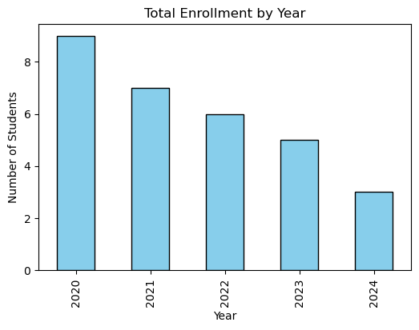

# 📊 Institutional Data Project  
_Automated Data Quality & Reporting Framework for Institutional Data_

## 🔎 Project Overview  
This project simulates the work of an **Institutional Data Analyst** by building an end-to-end workflow for analyzing, cleaning, and reporting higher education data.  
The goal is to demonstrate practical skills in:  
- **Data collection & management** (SQL, CSV/Excel ingestion, cleaning with Python/Pandas)  
- **Compliance-style reporting** (IPEDS/NYSED-style enrollment, retention, and graduation rates)  
- **Data quality automation** (validations, missing data checks, error logging)  
- **Interactive dashboards** (Python visualizations; extendable to Tableau/Power BI)  

The project replicates real institutional research tasks such as **tracking enrollment trends, student retention, graduation rates, and survey outcomes**.

---

## 🚀 Live Demo  
👉 [View the Interactive Dashboard on Streamlit](https://institutional-data-project-ggp4q5nrecxxfpam9vd39j.streamlit.app/)  

---

## 🛠️ Tech Stack  
- **Python (Pandas, NumPy, Matplotlib, Seaborn)** → cleaning, transformations, visualizations  
- **SQL (SQLite / PostgreSQL)** → schema creation, queries for enrollment & retention  
- **Jupyter Notebooks** → exploratory data analysis and documentation  
- **CSV/Excel** → mock institutional datasets  

---

## 📂 Project Structure  

institutional-data-project/
│── data/
│ └── sample_students.csv # mock dataset
│
│── sql_scripts/
│ ├── schema.sql # database schema
│ └── enrollment_queries.sql # SQL queries for reporting
│
│── python_scripts/
│ └── data_cleaning.py # cleaning + preprocessing script
│
│── notebooks/
│ └── analysis.ipynb # exploratory analysis notebook
│
│── reports/
│ ├── enrollment_by_year.png
│ ├── gender_distribution.png
│ ├── avg_age_by_major.png
│ ├── retention_by_year.png
│ ├── graduation_rate_by_major.png
│ └── age_distribution.png
│
│── REPORT.md # final project report with insights
│── README.md # project documentation

---

## 🎯 Key Features  
1. **Data Cleaning Pipeline**  
   - Handles missing values, invalid codes, and data type corrections  
   - Generates a summary report of cleaned data  

2. **Institutional Reporting**  
   - Enrollment by year and major  
   - Retention and graduation trends  
   - Gender distribution and demographic breakdowns  

3. **Dashboarding & Visualizations**  
   - Python visualizations (see `reports/`):  
     - `enrollment_by_year.png`  
     - `gender_distribution.png`  
     - `avg_age_by_major.png`  
     - `retention_by_year.png`  
     - `graduation_rate_by_major.png`  
     - `age_distribution.png`  
   - Ready to extend with Tableau/Power BI  

4. **Survey Analysis (Next Phase)**  
   - Framework prepared for mock student survey analysis  
   - To simulate alumni outcomes and faculty feedback  

---

## 📌 Why This Project?  
This project was built to align with responsibilities of an **Institutional Data Analyst**:  
✔ Writing SQL queries to extract/analyze data  
✔ Automating compliance-style reports (IPEDS, NYSED)  
✔ Supporting cross-departmental stakeholders with clear dashboards  
✔ Maintaining **data integrity, accuracy, and usability**  

---

## 📊 Sample Output  
  
*Example visualization: Total enrollment by year*
